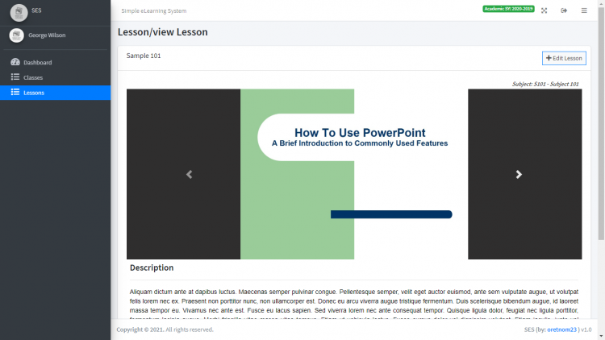

# eLearning System using PHP/MySQLi

### Description

<i>This is a PHP Project entitled eLearning System. This project helps a certain school to provide an online platform for of learning system. This simple system organized the data of the school such as the list of classes, student subjects, faculty subject loads, and subject lessons.</i>

### Features

<strong>Admin Panel</strong>
<ul>
  <li><strong>Manage System Info</strong></li>
  <li><strong>Manage Academic Year List</strong></li>
  <li><strong>Manage Department List</strong></li>
  <li><strong>Manage Course List</strong></li>
  <li><strong>Manage Subject List</strong></li>
  <li><strong>Manage Faculty List</strong></li>
  <li><strong>Manage Faculty Subject Loads</strong></li>
  <li><strong>Manage Student List</strong></li>
  <li><strong>Manage Class List</strong></li>
  <li><strong>Manage Account Details</strong></li>
</ul>

<strong>Faculty</strong>

<ul>
  <li><strong>Login/Logout</strong></li>
  <li><strong>View My Class List</strong></li>
  <li><strong>View My Lesson Created</strong></li>
  <li><strong>Manage Lesson</strong></li>
  <li><strong>Manage Account Details</strong></li>
</ul>

Visit [sourcecodester.com](https://www.sourcecodester.com/php/14787/elearning-system-using-phpmysqli-source-code.html) for more detailed information about this eLearning System Project.

### Website Details

| Title | eLearning System using PHP/MySQLi with Source Code |
|:---|:---|
| Website | [www.sourcecodester.com](https://www.sourcecodester.com) |
| Link | https://www.sourcecodester.com/php/14787/elearning-system-using-phpmysqli-source-code.html |
| Language | PHP |
| Developer/Uploader | [oretnom23](https://www.sourcecodester.com/users/tips23) |
